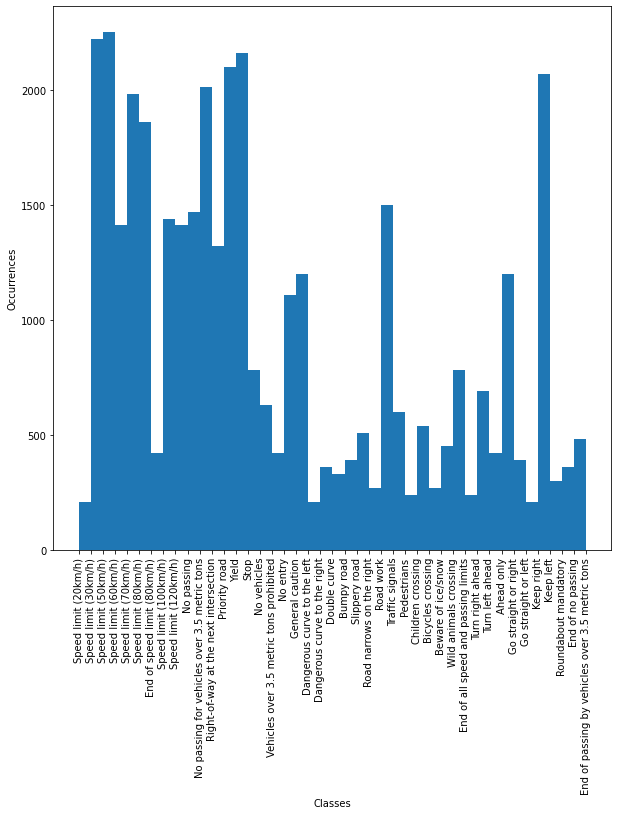

# Traffic sign detection

The following project has as an objective to build a Neural Network capable of properly classify different traffic signs, for this project we will use the German Traffic Sign Recognition Benchmark available at the following link: https://sid.erda.dk/public/archives/daaeac0d7ce1152aea9b61d9f1e19370/published-archive.html.

The model was trained on google collab.

# Dataset

The dataset is divided on the training set and the testing set, with the training set containing 39209 pictures and the test set 12630 pictures, roughly a 75-25 ratio. There are also 43 different classes to which each image can belong to. 

Pictures for each one of the classes:

Histogram of the count of instances for each class:

# Pre-processing 

The images have to be scaled to a 48x48 pixel image, and we need to roll the axis.

# Model

I use keras to build the CNN, the CNN used is the following.

After trying several variations of the CNN, with different parameters, I've found this to be the one with the best accuracy on the test data.

# Results

The accuracy on the test set is 98.33%, which is pretty good for our simple model and higher than a lot of participants on kaggle.

# Mismatches 

# Conclusions

The results obtained were satisfactory, the accuracy wasn't bad at all on the never seen dataset, with over 98% of traffic signs being properly recognized (out of 43 classes). While this is impressive, more could be done to improve the quality of the model.

Some ideas include:

* Increasing the luminosity of the pictures using opencv.

* Detecting the contours of each traffic sign, and cropping it off, making sure they are all position the same way.
